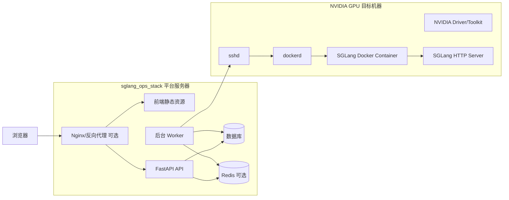
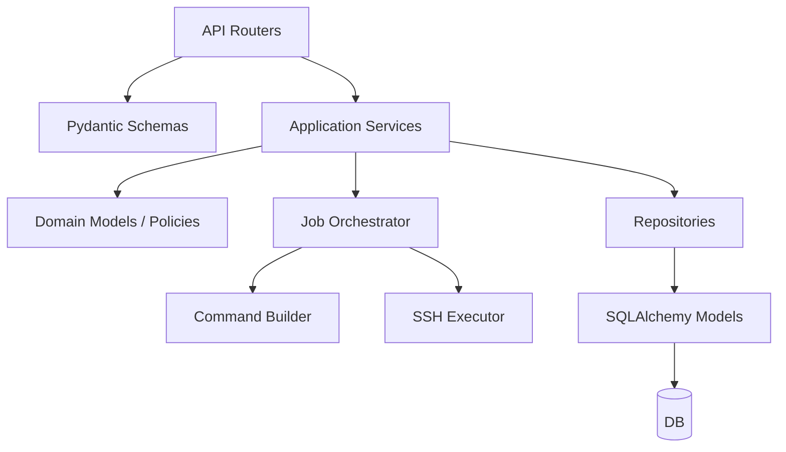
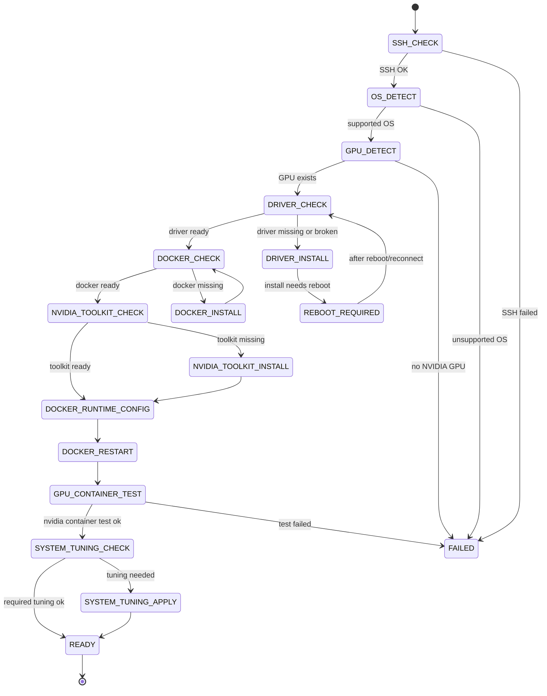
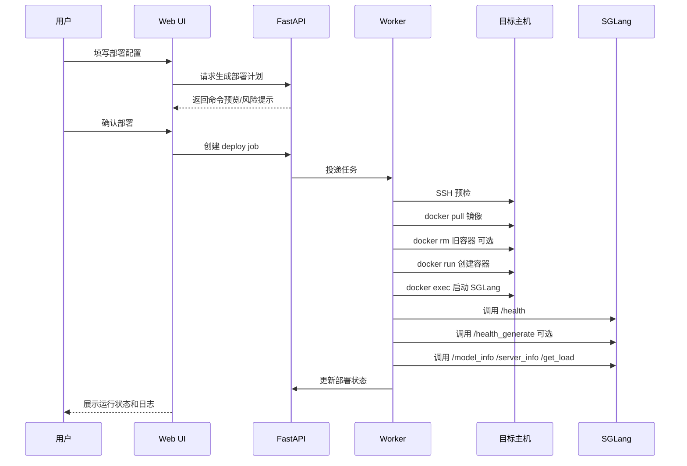
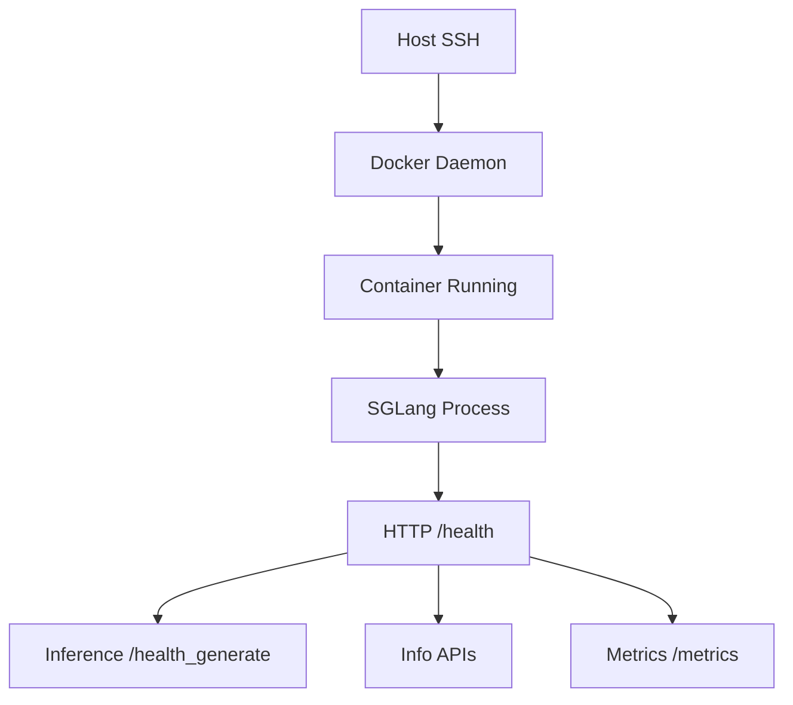
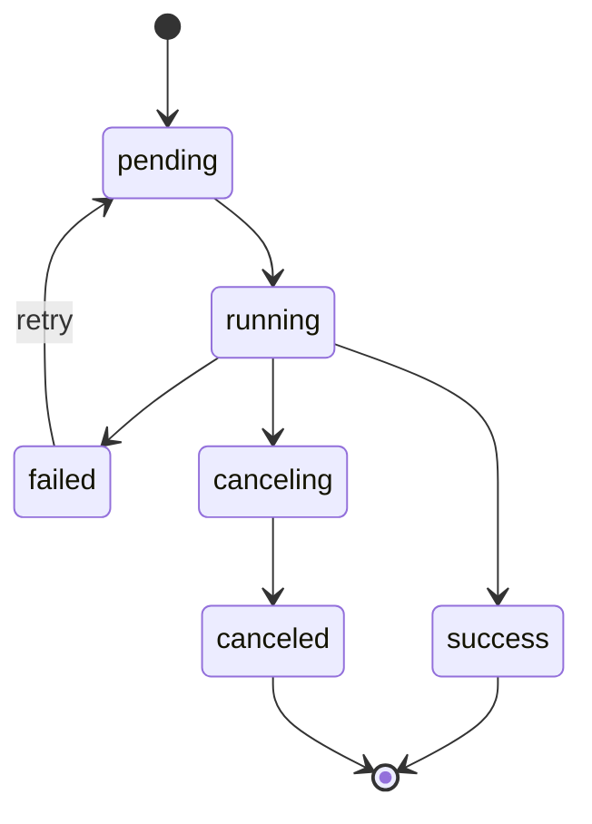

# SGLang Ops Stack 架构设计与技术规划

> 文档性质：架构设计与技术点规划
> 当前阶段：形成后续 Python Web 项目落地的工程设计
> 目标 Python 版本：Python 3.11+
> 推荐落地文档路径：`docs/architecture-and-technical-plan.md`

---

## 1. 项目目标与范围

### 1.1 项目目标

SGLang Ops Stack 的目标是建设一个面向 SGLang 推理引擎的安装、部署、运维、探活、监控一站式 Web 平台。平台以 Python 3.11+ 为主体技术栈，通过网页完成所有操作，为用户提供从“输入一台 NVIDIA GPU 服务器信息”到“SGLang 容器运行并可观测”的闭环能力。

平台需要覆盖以下核心目标：

1. **主机接入**：用户在 Web 页面录入 NVIDIA GPU 服务器的 IP、SSH 端口、root 用户凭据或后续扩展的密钥凭据。
2. **环境安装**：在目标机器上自动检查并安装 GPU 驱动相关运行环境、Docker、NVIDIA Container Toolkit 等 SGLang 容器运行前置条件。
3. **容器部署**：用户输入 SGLang Docker 镜像、模型路径、端口、并行参数、显存参数等运行配置后，平台自动拉取镜像、创建并启动容器。
4. **服务启动**：在容器内启动 SGLang 服务，推荐使用 `sglang serve`，兼容 `python3 -m sglang.launch_server`。
5. **分层探活**：展示主机、Docker、容器、SGLang 进程、SGLang HTTP 服务、推理链路等多层状态。
6. **运维操作**：支持重启 SGLang 容器、停止容器、修改参数后重新部署、查看部署历史和任务日志。
7. **监控集成**：配置 Prometheus/Grafana 地址，在 Web 页面跳转或嵌入展示监控页面，并基于 SGLang `/metrics` 提供 Prometheus scrape target 说明。
8. **安全审计**：对 root 密码、远程执行、敏感日志、危险 Docker 参数进行安全约束与审计设计。

### 1.2 当前阶段范围

当前阶段只输出架构设计与技术规划，不实现业务代码。本文档需要指导后续开发者直接搭建项目骨架、划分模块、定义数据模型、实现远程执行与任务编排。

当前阶段包含：

- 推荐项目目录结构。
- 后端模块边界设计。
- 前端页面与交互流程设计。
- 数据模型设计。
- SSH 远程执行与命令构建规则。
- GPU/Docker 安装状态机。
- SGLang 容器部署与重新部署流程。
- 探活、状态展示、监控集成、安全、日志、任务、审计、测试策略。
- 分阶段实施计划。

当前阶段不包含：

- 不编写 FastAPI、前端、Worker 等业务代码。
- 不实际连接远程服务器。
- 不执行安装 Docker、GPU 驱动、拉镜像、启动容器等命令。
- 不提交业务代码变更。

### 1.3 参考材料与可复用点

参考项目 `sglang_run` 当前定位为命令生成工具，不执行远程命令。新平台应复用其“配置建模 + 参数默认值 + 命令拼接 + Host Check 检查项组织”的思路，但需要升级为：

- 命令对象建模。
- 参数白名单与类型校验。
- 安全 SSH 远程执行。
- 后台任务与日志流。
- 状态持久化与审计。

SGLang 源码提供以下关键事实：

- 服务入口仍支持 `python -m sglang.launch_server`，推荐 `sglang serve`。
- 参数定义集中在 `python/sglang/srt/server_args.py`。
- HTTP 服务实现位于 `python/sglang/srt/entrypoints/http_server.py`。
- 指标需通过 `--enable-metrics` 开启，并暴露 `/metrics`。
- 健康检查接口包括 `/health`、`/health_generate`。
- 状态接口包括 `/model_info`、`/server_info`、`/get_load`。

---

## 2. 用户场景与核心流程

### 2.1 主要用户角色

| 角色 | 使用目标 | 主要操作 |
|---|---|---|
| 平台管理员 | 管理平台用户、凭据、安全策略、审计 | 配置系统参数、查看审计日志、管理主机 |
| 运维人员 | 接入 GPU 服务器并部署 SGLang | 新增主机、安装环境、部署容器、重启服务、查看日志 |
| 算法/推理服务人员 | 调整 SGLang 参数并验证模型服务 | 修改模型路径、端口、TP/DP/PP、显存比例、健康检查 |
| 观察者 | 查看状态与监控 | 查看部署状态、跳转 Grafana、查看 Prometheus 指标 |

第一阶段可先实现单用户或弱权限模型，但数据模型与审计设计应预留多用户扩展。

### 2.2 主机接入流程

1. 用户进入“主机管理”页面。
2. 点击“新增主机”。
3. 输入：
   - 主机名称。
   - IP 地址。
   - SSH 端口，默认 `22`。
   - 登录用户，第一阶段默认 `root`。
   - root 密码，第一阶段建议会话级使用，不落库；后续可接入密钥或密文存储。
   - 备注、机房、标签等可选信息。
4. 平台执行 SSH 连通性检查。
5. 平台执行基础探测：OS、内核、CPU、内存、GPU、NVIDIA 驱动、Docker、NVIDIA Container Toolkit。
6. 页面展示主机接入状态和检查报告。

### 2.3 GPU/Docker 环境安装流程

1. 用户选择一台已接入主机。
2. 进入“环境安装”页面。
3. 点击“检查环境”。
4. 平台创建后台 Job，按状态机执行检查。
5. 检查项包括：
   - SSH 连通性。
   - OS 发行版与版本。
   - NVIDIA GPU 是否存在。
   - NVIDIA 驱动是否安装。
   - `nvidia-smi` 是否可用。
   - Docker 是否安装并运行。
   - NVIDIA Container Toolkit 是否安装。
   - Docker runtime 是否支持 NVIDIA。
   - `docker run --gpus all ... nvidia-smi` 是否可用。
   - 系统 ulimit、`nvidia_peermem`、网络配置等可选检查。
6. 如存在缺失项，页面展示“可修复项”。
7. 用户点击“自动安装/修复”。
8. 平台创建安装 Job，按幂等状态机执行安装和修复。
9. 每一步日志通过 WebSocket 或 SSE 实时显示。
10. 安装完成后自动重新检查并给出最终状态。

### 2.4 SGLang 部署流程

1. 用户进入“部署管理”页面。
2. 点击“新建部署”。
3. 选择目标主机。
4. 输入 Docker 配置：
   - 镜像，默认可参考 `lmsysorg/sglang:latest`。
   - 容器名，默认 `sglang`，同一主机需唯一。
   - shm size，默认 `32g`。
   - 端口与 network 模式。
   - GPU 选择，第一阶段可默认 `all`。
   - volume 挂载，例如模型目录、缓存目录、日志目录。
5. 输入 SGLang 参数：
   - `model_path`。
   - `served_model_name`。
   - `host`，容器内通常为 `0.0.0.0`。
   - `port`。
   - `tp_size`、`dp_size`、`pp_size`。
   - `mem_fraction_static`。
   - `enable_dp_attention`。
   - `enable_cache_report`。
   - `trust_remote_code`。
   - `enable_metrics`，建议默认开启。
   - 其他扩展参数通过白名单字段或高级参数面板控制。
6. 用户点击“生成部署计划”。
7. 页面展示将执行的命令摘要和风险提示。
8. 用户确认后创建部署 Job。
9. Job 执行：环境预检 → 拉镜像 → 清理旧容器或创建新容器 → 启动容器 → 启动 SGLang 服务 → 分层探活 → 更新状态。
10. 页面展示容器状态、服务状态、健康检查、日志、监控入口。

### 2.5 运维流程

#### 2.5.1 重启 SGLang 容器

1. 用户进入部署详情页。
2. 点击“重启容器”。
3. 平台提示影响范围和风险。
4. 用户确认。
5. 创建重启 Job。
6. 执行 `docker restart <container_name>` 或更精细的停止/启动流程。
7. 重新执行分层探活。
8. 更新部署状态与审计日志。

#### 2.5.2 修改参数重新部署

1. 用户进入部署详情页。
2. 点击“修改参数”。
3. 页面加载上次部署配置。
4. 用户修改镜像、模型路径、端口、TP/DP/PP、显存等参数。
5. 平台生成配置 diff。
6. 用户确认。
7. 创建重新部署 Job。
8. Job 备份旧配置和旧命令。
9. 停止旧容器或创建新版本容器。
10. 启动新容器和 SGLang 服务。
11. 执行健康检查。
12. 若失败，第一阶段建议保留旧配置和失败日志，由用户手动回滚；后续可支持自动回滚。

### 2.6 监控跳转流程

1. 管理员或运维人员配置 Prometheus/Grafana URL。
2. 部署详情页展示：
   - Grafana 入口。
   - Prometheus 入口。
   - 当前部署建议 scrape target：`http://<host>:<sglang_port>/metrics`。
3. 用户点击跳转到 Grafana 或嵌入 iframe 页面。
4. 如果 Grafana 需要登录，平台只负责跳转，不代理凭据。

---

## 3. 总体架构图

### 3.1 逻辑架构

```mermaid
flowchart TB
    User[用户浏览器] --> WebUI[Web 前端]
    WebUI --> API[FastAPI 后端 API]
    WebUI --> LogStream[WebSocket/SSE 日志流]

    API --> Auth[认证与权限模块]
    API --> HostSvc[主机管理服务]
    API --> DeploySvc[部署管理服务]
    API --> OpsSvc[运维操作服务]
    API --> MonitorSvc[监控集成服务]
    API --> JobSvc[任务编排服务]

    JobSvc --> Queue[任务队列/调度器]
    Queue --> Worker[后台 Worker]

    Worker --> SSH[SSH 执行器]
    SSH --> RemoteHost[NVIDIA GPU 目标主机]

    RemoteHost --> Docker[Docker / NVIDIA Runtime]
    Docker --> Container[SGLang 容器]
    Container --> SGLang[SGLang Server]

    SGLang --> Health[/health /health_generate]
    SGLang --> Metrics[/metrics]
    SGLang --> Info[/model_info /server_info /get_load]

    API --> DB[(PostgreSQL 或 SQLite)]
    Worker --> DB
    Worker --> LogStore[(任务日志存储)]

    MonitorSvc --> Grafana[Grafana]
    MonitorSvc --> Prometheus[Prometheus]
    Prometheus --> Metrics
```

### 3.2 部署架构



### 3.3 后端分层



---

## 4. 技术选型

### 4.1 后端技术栈

| 分类 | 推荐选型 | 理由 |
|---|---|---|
| Python 版本 | Python 3.11+ | 满足用户要求，类型能力、性能和生态较成熟 |
| Web 框架 | FastAPI | 异步友好、Pydantic 集成、OpenAPI 自动文档、适合 API 平台 |
| ASGI Server | Uvicorn / Gunicorn + Uvicorn Worker | 标准 FastAPI 部署方式 |
| 数据校验 | Pydantic v2 | 强类型校验、适合命令参数白名单建模 |
| ORM | SQLAlchemy 2.x | 成熟、支持 SQLite/PostgreSQL、便于迁移 |
| 数据库迁移 | Alembic | 标准迁移工具 |
| 数据库 | 第一阶段 SQLite，生产推荐 PostgreSQL | SQLite 便于快速开发，PostgreSQL 适合并发和生产 |
| 后台任务 | Celery + Redis，或 Dramatiq/RQ | 安装部署是长任务，需要可靠 Worker 与日志流 |
| 简化 MVP 任务 | FastAPI BackgroundTasks + asyncio 队列 | 适合最小原型，但不建议生产长期使用 |
| SSH 客户端 | AsyncSSH 或 Paramiko | 远程执行命令核心能力；AsyncSSH 更适合异步架构 |
| HTTP 客户端 | HTTPX | 探活和状态接口调用 |
| 配置管理 | pydantic-settings | 环境变量、配置文件统一管理 |
| 日志 | structlog 或 logging + JSON formatter | 任务日志、审计日志结构化 |
| API 鉴权 | Session/JWT，第一阶段可简单登录 | 后续扩展 RBAC |

### 4.2 前端技术栈

有两条路线：

#### 方案 A：FastAPI + Jinja2 + HTMX + Alpine.js

适合第一阶段快速落地，后端团队可以用 Python 主导开发。

优点：

- 项目复杂度低。
- 页面表单、任务日志、状态刷新容易实现。
- 不需要完整 Node 前端工程。
- 符合“主体是 Python 代码”的要求。

缺点：

- 复杂状态管理和大型组件化能力弱于 React/Vue。

#### 方案 B：FastAPI API + React/Vue 前端

适合后续产品化。

优点：

- 交互体验更好。
- 适合复杂表格、配置 diff、日志终端、监控嵌入。

缺点：

- 工程复杂度更高。
- 前后端协作成本更高。

#### 推荐

第一阶段推荐 **FastAPI + Jinja2 + HTMX + Alpine.js**，在后端 Python 项目中内置 templates/static。后续如页面复杂度上升，再迁移到 React/Vue 独立前端。

### 4.3 任务与日志流

| 能力 | MVP | 生产建议 |
|---|---|---|
| 后台任务 | FastAPI BackgroundTasks / asyncio task | Celery + Redis |
| 任务状态 | 数据库轮询 | 数据库 + Redis 状态缓存 |
| 日志流 | SSE | WebSocket 或 SSE |
| 日志存储 | DB 表或本地文件 | DB 元数据 + 对象存储/文件日志 |

推荐第一阶段使用 SSE 展示 Job 日志，因为从服务器到浏览器单向推送足够满足安装、部署日志查看需求，实现复杂度低于 WebSocket。

### 4.4 数据库选型

- 开发/MVP：SQLite。
- 生产：PostgreSQL。

原因：

- SQLite 便于快速初始化空项目。
- 部署任务、审计、日志并发增加后，PostgreSQL 更可靠。
- SQLAlchemy 可屏蔽大部分差异。

---

## 5. 推荐代码目录结构

建议项目采用 `src` layout，便于打包和测试隔离。

```text
sglang_ops_stack/
├── README.md
├── LICENSE
├── pyproject.toml
├── .env.example
├── alembic.ini
├── docs/
│   ├── architecture-and-technical-plan.md
│   ├── security.md
│   ├── operations.md
│   └── api.md
├── src/
│   └── sglang_ops_stack/
│       ├── __init__.py
│       ├── main.py
│       ├── config.py
│       ├── logging_config.py
│       ├── api/
│       │   ├── __init__.py
│       │   ├── deps.py
│       │   ├── routers/
│       │   │   ├── __init__.py
│       │   │   ├── pages.py
│       │   │   ├── auth.py
│       │   │   ├── hosts.py
│       │   │   ├── environment.py
│       │   │   ├── deployments.py
│       │   │   ├── jobs.py
│       │   │   ├── logs.py
│       │   │   ├── health.py
│       │   │   └── monitoring.py
│       │   └── schemas/
│       │       ├── __init__.py
│       │       ├── host.py
│       │       ├── environment.py
│       │       ├── deployment.py
│       │       ├── job.py
│       │       ├── log.py
│       │       ├── monitoring.py
│       │       └── common.py
│       ├── core/
│       │   ├── __init__.py
│       │   ├── security.py
│       │   ├── crypto.py
│       │   ├── permissions.py
│       │   ├── exceptions.py
│       │   └── time.py
│       ├── db/
│       │   ├── __init__.py
│       │   ├── session.py
│       │   ├── base.py
│       │   ├── models/
│       │   │   ├── __init__.py
│       │   │   ├── user.py
│       │   │   ├── host.py
│       │   │   ├── credential.py
│       │   │   ├── deployment.py
│       │   │   ├── job.py
│       │   │   ├── log.py
│       │   │   ├── audit.py
│       │   │   └── monitoring.py
│       │   └── repositories/
│       │       ├── __init__.py
│       │       ├── hosts.py
│       │       ├── deployments.py
│       │       ├── jobs.py
│       │       ├── logs.py
│       │       └── audits.py
│       ├── domain/
│       │   ├── __init__.py
│       │   ├── enums.py
│       │   ├── states.py
│       │   ├── policies.py
│       │   ├── command.py
│       │   ├── host_check.py
│       │   ├── deployment_config.py
│       │   └── health_model.py
│       ├── services/
│       │   ├── __init__.py
│       │   ├── host_service.py
│       │   ├── environment_service.py
│       │   ├── deployment_service.py
│       │   ├── operation_service.py
│       │   ├── monitoring_service.py
│       │   ├── health_service.py
│       │   ├── audit_service.py
│       │   └── log_service.py
│       ├── remote/
│       │   ├── __init__.py
│       │   ├── ssh_client.py
│       │   ├── executor.py
│       │   ├── result.py
│       │   ├── sudo.py
│       │   └── file_transfer.py
│       ├── commands/
│       │   ├── __init__.py
│       │   ├── base.py
│       │   ├── shell_quote.py
│       │   ├── host_checks.py
│       │   ├── gpu_install.py
│       │   ├── docker_install.py
│       │   ├── docker_runtime.py
│       │   ├── docker_container.py
│       │   ├── sglang_server.py
│       │   └── validators.py
│       ├── jobs/
│       │   ├── __init__.py
│       │   ├── app.py
│       │   ├── worker.py
│       │   ├── base.py
│       │   ├── registry.py
│       │   ├── environment_jobs.py
│       │   ├── deployment_jobs.py
│       │   ├── operation_jobs.py
│       │   ├── health_jobs.py
│       │   └── progress.py
│       ├── integrations/
│       │   ├── __init__.py
│       │   ├── prometheus.py
│       │   ├── grafana.py
│       │   └── sglang_http.py
│       ├── web/
│       │   ├── __init__.py
│       │   ├── templates/
│       │   │   ├── base.html
│       │   │   ├── dashboard.html
│       │   │   ├── hosts/
│       │   │   ├── deployments/
│       │   │   ├── jobs/
│       │   │   └── monitoring/
│       │   └── static/
│       │       ├── css/
│       │       ├── js/
│       │       └── img/
│       └── utils/
│           ├── __init__.py
│           ├── masking.py
│           ├── ids.py
│           └── formatters.py
├── tests/
│   ├── unit/
│   │   ├── test_command_builders.py
│   │   ├── test_validators.py
│   │   ├── test_state_machines.py
│   │   └── test_health_model.py
│   ├── integration/
│   │   ├── test_ssh_executor_fake.py
│   │   ├── test_deployment_flow.py
│   │   └── test_monitoring_integration.py
│   └── e2e/
│       └── test_web_flows.py
└── alembic/
    ├── env.py
    └── versions/
```

### 5.1 目录职责说明

| 目录 | 职责 |
|---|---|
| `api/routers` | HTTP API 与页面路由，不包含核心业务逻辑 |
| `api/schemas` | Pydantic 请求/响应模型 |
| `core` | 安全、异常、配置、权限等基础能力 |
| `db/models` | SQLAlchemy ORM 模型 |
| `db/repositories` | 数据访问层 |
| `domain` | 状态枚举、领域模型、策略规则、健康模型 |
| `services` | 应用服务，编排 Repository、Job、集成模块 |
| `remote` | SSH 连接、命令执行、文件传输 |
| `commands` | 命令对象与构建器，避免直接拼接裸字符串 |
| `jobs` | 后台任务定义、状态更新、进度上报 |
| `integrations` | Prometheus、Grafana、SGLang HTTP API 集成 |
| `web/templates` | Jinja2 页面模板 |
| `web/static` | CSS、JS、图片等静态资源 |
| `tests` | 单元、集成、端到端测试 |

---

## 6. 后端模块设计

### 6.1 API 层

API 层负责接收用户请求、参数校验、调用 Service、返回页面或 JSON。API 层不应直接构建 shell 命令，不应直接执行 SSH，不应直接操作 ORM Session 之外的复杂业务。

推荐路由：

| 路由模块 | 示例路径 | 职责 |
|---|---|---|
| `pages.py` | `GET /` | 页面入口、Dashboard |
| `auth.py` | `/auth/*` | 登录、退出、用户会话 |
| `hosts.py` | `/api/hosts` | 主机 CRUD、连通性检查 |
| `environment.py` | `/api/hosts/{id}/environment/*` | 环境检查、安装、修复 |
| `deployments.py` | `/api/deployments` | 部署 CRUD、部署、重新部署 |
| `jobs.py` | `/api/jobs` | Job 查询、取消、重试 |
| `logs.py` | `/api/jobs/{id}/logs` | 日志查询和 SSE 日志流 |
| `health.py` | `/api/deployments/{id}/health` | 手动探活、状态刷新 |
| `monitoring.py` | `/api/monitoring/*` | Prometheus/Grafana 配置与跳转 |

### 6.2 Service 层

Service 层承载应用用例，是后续开发最核心的业务编排层。

#### 6.2.1 HostService

职责：

- 新增、编辑、删除主机。
- 校验 IP、端口、标签。
- 触发 SSH 连通性检查 Job。
- 汇总主机环境状态。
- 管理主机凭据引用，不直接暴露明文密码。

关键方法建议：

```python
class HostService:
    def create_host(input: HostCreate) -> HostDTO: ...
    def update_host(host_id: int, input: HostUpdate) -> HostDTO: ...
    def test_connection(host_id: int, credential: RuntimeCredential) -> JobDTO: ...
    def get_host_summary(host_id: int) -> HostSummaryDTO: ...
```

#### 6.2.2 EnvironmentService

职责：

- 触发环境检查 Job。
- 触发 GPU/Docker 自动安装 Job。
- 读取检查结果。
- 根据检查结果生成修复建议。

关键方法建议：

```python
class EnvironmentService:
    def start_environment_check(host_id: int) -> JobDTO: ...
    def start_environment_install(host_id: int, options: InstallOptions) -> JobDTO: ...
    def get_environment_report(host_id: int) -> EnvironmentReportDTO: ...
```

#### 6.2.3 DeploymentService

职责：

- 创建部署配置。
- 生成部署计划和命令预览。
- 创建部署、重新部署 Job。
- 管理部署版本和历史配置。
- 更新部署状态。

关键方法建议：

```python
class DeploymentService:
    def create_deployment(input: DeploymentCreate) -> DeploymentDTO: ...
    def preview_deploy_plan(deployment_id: int) -> DeployPlanDTO: ...
    def start_deploy(deployment_id: int) -> JobDTO: ...
    def start_redeploy(deployment_id: int, input: DeploymentUpdate) -> JobDTO: ...
    def get_deployment_detail(deployment_id: int) -> DeploymentDetailDTO: ...
```

#### 6.2.4 OperationService

职责：

- 重启容器。
- 停止容器。
- 启动容器。
- 获取容器日志。
- 执行安全白名单内的运维操作。

关键方法建议：

```python
class OperationService:
    def restart_container(deployment_id: int) -> JobDTO: ...
    def stop_container(deployment_id: int) -> JobDTO: ...
    def start_container(deployment_id: int) -> JobDTO: ...
    def fetch_container_logs(deployment_id: int, tail: int = 500) -> JobDTO: ...
```

#### 6.2.5 HealthService

职责：

- 分层探活。
- 调用 SGLang `/health`、`/health_generate`、`/model_info`、`/server_info`、`/get_load`。
- 聚合主机、容器、进程、HTTP 服务、推理链路状态。

关键方法建议：

```python
class HealthService:
    def check_host_layer(host_id: int) -> LayerHealth: ...
    def check_docker_layer(deployment_id: int) -> LayerHealth: ...
    def check_container_layer(deployment_id: int) -> LayerHealth: ...
    def check_sglang_http_layer(deployment_id: int) -> LayerHealth: ...
    def check_inference_layer(deployment_id: int) -> LayerHealth: ...
    def aggregate(deployment_id: int) -> DeploymentHealthReport: ...
```

#### 6.2.6 MonitoringService

职责：

- 保存 Prometheus/Grafana 地址配置。
- 生成部署对应的 `/metrics` scrape target。
- 生成 Grafana 跳转链接。
- 可选校验 Prometheus/Grafana 可访问性。

### 6.3 Domain 层

Domain 层应定义清晰枚举和领域策略，避免状态字符串散落在代码各处。

建议状态枚举：

```python
class JobStatus(str, Enum):
    PENDING = "pending"
    RUNNING = "running"
    SUCCESS = "success"
    FAILED = "failed"
    CANCELED = "canceled"

class DeploymentStatus(str, Enum):
    DRAFT = "draft"
    DEPLOYING = "deploying"
    RUNNING = "running"
    DEGRADED = "degraded"
    STOPPED = "stopped"
    FAILED = "failed"
    REDEPLOYING = "redeploying"

class HealthStatus(str, Enum):
    UNKNOWN = "unknown"
    OK = "ok"
    WARN = "warn"
    ERROR = "error"
```

### 6.4 Repository 层

Repository 层负责数据库读写，Service 层不直接依赖 ORM 细节。

示例：

```python
class DeploymentRepository:
    def get(self, deployment_id: int) -> Deployment: ...
    def list_by_host(self, host_id: int) -> list[Deployment]: ...
    def save(self, deployment: Deployment) -> Deployment: ...
    def update_status(self, deployment_id: int, status: DeploymentStatus) -> None: ...
```

### 6.5 集成模块

#### SGLang HTTP 集成

封装对 SGLang HTTP API 的调用：

- `GET /health`
- `GET /health_generate`
- `GET /model_info`
- `GET /server_info`
- `GET /get_load`
- `GET /metrics`

注意：即使 SGLang 配置了 API key，健康和指标接口可能仍允许访问，因此平台应通过网络隔离、防火墙或反向代理保护这些 endpoint。

---

## 7. 前端页面设计

### 7.1 页面总览

| 页面 | 路径建议 | 功能 |
|---|---|---|
| Dashboard | `/` | 全局主机、部署、告警、任务概览 |
| 主机列表 | `/hosts` | 查看、新增、编辑、删除主机 |
| 主机详情 | `/hosts/{id}` | 环境检查结果、GPU/Docker 状态、部署列表 |
| 环境安装 | `/hosts/{id}/environment` | 检查、安装、修复、日志展示 |
| 部署列表 | `/deployments` | 查看所有 SGLang 部署 |
| 新建部署 | `/deployments/new` | 输入 Docker/SGLang 参数 |
| 部署详情 | `/deployments/{id}` | 状态、健康、日志、运维操作、监控入口 |
| 重新部署 | `/deployments/{id}/edit` | 修改参数、配置 diff、确认重新部署 |
| 任务中心 | `/jobs` | 查看 Job 列表、状态、耗时、结果 |
| 任务详情 | `/jobs/{id}` | 实时日志、步骤进度、错误信息 |
| 监控配置 | `/monitoring/settings` | Prometheus/Grafana URL 配置 |
| 审计日志 | `/audits` | 查看用户操作与远程命令审计 |

### 7.2 Dashboard

Dashboard 应展示：

- 主机数量：总数、在线、异常。
- 部署数量：运行中、异常、停止、部署中。
- 最近 Job：状态、耗时、操作者。
- 异常摘要：SSH 失败、Docker 不可用、SGLang 不健康、metrics 不可达。
- 快捷入口：新增主机、新建部署、查看监控。

### 7.3 主机管理页面

字段设计：

- 主机名称。
- IP 地址。
- SSH 端口。
- 登录用户。
- 凭据输入框。
- 标签。
- 备注。

交互设计：

- “测试连接”按钮。
- “检查环境”按钮。
- “安装/修复环境”按钮。
- 敏感输入不回显。
- 页面上任何日志中的密码必须脱敏。

### 7.4 环境安装页面

页面区块：

1. 主机基本信息。
2. 检查项表格：检查项、当前状态、期望状态、修复建议。
3. 状态机进度条。
4. 实时日志窗口。
5. 操作按钮：检查、安装、取消、重试。

检查项示例：

| 检查项 | 状态 | 说明 |
|---|---|---|
| SSH | OK/ERROR | 是否可连接 |
| OS | OK/WARN/ERROR | 是否支持安装脚本 |
| GPU | OK/ERROR | 是否检测到 NVIDIA GPU |
| NVIDIA Driver | OK/WARN/ERROR | `nvidia-smi` 是否可用 |
| Docker | OK/WARN/ERROR | Docker 是否安装并运行 |
| NVIDIA Runtime | OK/WARN/ERROR | Docker 是否支持 `--gpus all` |
| Container Test | OK/ERROR | 测试容器内执行 `nvidia-smi` |

### 7.5 新建部署页面

建议将表单分为四组：

#### Docker 基础配置

- 镜像。
- 容器名。
- shm size。
- network 模式。
- GPU 参数。
- volume 挂载。
- 环境变量。

#### SGLang 服务参数

- 启动方式：推荐 `sglang serve`，兼容 `python3 -m sglang.launch_server`。
- 模型路径。
- served model name。
- host。
- port。
- tp size。
- dp size。
- pp size。
- mem fraction static。
- trust remote code。
- enable metrics。
- enable cache report。
- enable dp attention。

#### 高级参数

- 自定义白名单参数。
- 启动超时时间。
- 健康检查策略。
- 日志级别。

#### 部署预览

展示：

- Docker run 命令预览。
- 容器内 SGLang 启动命令预览。
- Prometheus scrape target。
- 安全风险提示。

### 7.6 部署详情页面

页面区块：

1. 部署摘要：状态、主机、容器名、镜像、端口、模型。
2. 分层健康状态：主机、Docker、容器、进程、HTTP、推理链路、metrics。
3. 操作按钮：重启、停止、启动、重新部署、刷新探活、查看日志。
4. 当前配置。
5. 最近任务。
6. 容器日志。
7. SGLang 状态接口数据。
8. Grafana/Prometheus 跳转入口。

### 7.7 任务详情页面

任务详情页是平台可用性的关键页面，应包含：

- Job ID。
- Job 类型。
- 当前状态。
- 操作者。
- 开始/结束时间。
- 步骤列表。
- 每步状态。
- 实时日志。
- 错误摘要。
- 重试按钮。

---

## 8. 数据模型设计

### 8.1 User

第一阶段可以简化，但仍建议预留用户表。

| 字段 | 类型 | 说明 |
|---|---|---|
| id | int | 主键 |
| username | str | 用户名 |
| password_hash | str | 密码哈希 |
| role | str | admin/operator/viewer |
| is_active | bool | 是否启用 |
| created_at | datetime | 创建时间 |
| updated_at | datetime | 更新时间 |

### 8.2 Host

| 字段 | 类型 | 说明 |
|---|---|---|
| id | int | 主键 |
| name | str | 主机名称 |
| ip | str | IP 地址 |
| ssh_port | int | SSH 端口 |
| ssh_user | str | SSH 用户，第一阶段默认 root |
| auth_type | str | password/key/session_only |
| credential_ref | str/null | 凭据引用，第一阶段可为空 |
| tags | json | 标签 |
| note | text | 备注 |
| os_info | json | OS 探测结果 |
| gpu_info | json | GPU 探测结果 |
| docker_info | json | Docker 探测结果 |
| environment_status | str | unknown/checking/ready/degraded/failed |
| last_check_at | datetime | 最近检查时间 |
| created_at | datetime | 创建时间 |
| updated_at | datetime | 更新时间 |

### 8.3 Credential

凭据是敏感模型。第一阶段可选择不持久化 root 密码，只在 Job 创建时临时传入 Worker 内存。如果必须落库，应使用 KMS 或本地密钥加密。

| 字段 | 类型 | 说明 |
|---|---|---|
| id | int | 主键 |
| host_id | int | 关联主机 |
| type | str | password/private_key |
| encrypted_secret | text | 加密后的密文 |
| secret_fingerprint | str | 指纹，用于识别但不可还原 |
| created_by | int | 创建人 |
| created_at | datetime | 创建时间 |
| rotated_at | datetime/null | 轮换时间 |

安全要求：

- API 永不返回 `encrypted_secret`。
- 日志永不记录明文密码。
- 审计记录只记录凭据 ID 或指纹。
- 第一阶段推荐“会话级凭据”：用户发起 Job 时输入密码，Job 执行后立即丢弃。

### 8.4 Deployment

| 字段 | 类型 | 说明 |
|---|---|---|
| id | int | 主键 |
| name | str | 部署名称 |
| host_id | int | 目标主机 |
| status | str | draft/deploying/running/degraded/stopped/failed/redeploying |
| container_name | str | 容器名 |
| image | str | Docker 镜像 |
| docker_config | json | Docker 配置 |
| sglang_config | json | SGLang 参数 |
| service_url | str | SGLang 服务 URL |
| metrics_url | str | `/metrics` URL |
| last_command_preview | text | 脱敏后的上次命令预览 |
| last_health_status | json | 最近健康检查结果 |
| current_version | int | 当前配置版本 |
| created_by | int | 创建人 |
| created_at | datetime | 创建时间 |
| updated_at | datetime | 更新时间 |

### 8.5 DeploymentRevision

用于保存参数变更历史，支持 diff 和回滚设计。

| 字段 | 类型 | 说明 |
|---|---|---|
| id | int | 主键 |
| deployment_id | int | 部署 ID |
| version | int | 版本号 |
| docker_config | json | Docker 配置快照 |
| sglang_config | json | SGLang 配置快照 |
| command_preview | text | 脱敏命令预览 |
| change_summary | json | 变更摘要 |
| created_by | int | 创建人 |
| created_at | datetime | 创建时间 |

### 8.6 Job

| 字段 | 类型 | 说明 |
|---|---|---|
| id | str | Job ID，建议 UUID/ULID |
| type | str | environment_check/environment_install/deploy/redeploy/restart/health_check |
| status | str | pending/running/success/failed/canceled |
| target_type | str | host/deployment |
| target_id | int | 目标 ID |
| progress | int | 0-100 |
| current_step | str | 当前步骤 |
| input | json | 输入参数，必须脱敏 |
| result | json | 结果摘要 |
| error_code | str/null | 错误码 |
| error_message | text/null | 错误信息 |
| created_by | int | 创建人 |
| started_at | datetime/null | 开始时间 |
| finished_at | datetime/null | 结束时间 |
| created_at | datetime | 创建时间 |

### 8.7 JobStep

| 字段 | 类型 | 说明 |
|---|---|---|
| id | int | 主键 |
| job_id | str | Job ID |
| name | str | 步骤名称 |
| status | str | pending/running/success/failed/skipped |
| started_at | datetime/null | 开始时间 |
| finished_at | datetime/null | 结束时间 |
| result | json | 步骤结果 |
| error_message | text/null | 错误信息 |

### 8.8 JobLog

| 字段 | 类型 | 说明 |
|---|---|---|
| id | int | 主键 |
| job_id | str | Job ID |
| step_name | str | 所属步骤 |
| stream | str | stdout/stderr/system |
| level | str | info/warn/error/debug |
| message | text | 脱敏日志 |
| created_at | datetime | 创建时间 |

### 8.9 AuditLog

| 字段 | 类型 | 说明 |
|---|---|---|
| id | int | 主键 |
| actor_id | int | 操作者 |
| action | str | create_host/deploy/restart/redeploy/update_config/delete 等 |
| target_type | str | host/deployment/job |
| target_id | str | 目标 ID |
| request_summary | json | 请求摘要，脱敏 |
| command_summary | text/null | 命令摘要，脱敏 |
| ip_address | str | 用户来源 IP |
| user_agent | str | UA |
| created_at | datetime | 创建时间 |

### 8.10 MonitoringConfig

| 字段 | 类型 | 说明 |
|---|---|---|
| id | int | 主键 |
| name | str | 配置名称 |
| prometheus_url | str | Prometheus 地址 |
| grafana_url | str | Grafana 地址 |
| default_dashboard_url | str/null | 默认 Dashboard |
| enabled | bool | 是否启用 |
| created_at | datetime | 创建时间 |
| updated_at | datetime | 更新时间 |

---

## 9. 远程 SSH 执行与命令构建设计

### 9.1 核心原则

新平台会从“只生成 shell 命令”升级到“远程执行命令”。这是安全风险最大的模块，必须遵守：

1. **命令必须对象化建模**，不要在业务层散落字符串拼接。
2. **参数必须白名单校验**，禁止用户输入任意 shell 片段。
3. **命令执行前必须生成可审计的脱敏预览**。
4. **远程执行必须捕获 stdout、stderr、exit_code、开始/结束时间**。
5. **所有日志必须经过敏感信息脱敏**。
6. **危险操作必须由明确的 Job 类型承载，并写入审计日志**。

### 9.2 命令对象模型

建议设计 CommandSpec：

```python
@dataclass
class CommandSpec:
    executable: str
    args: list[str]
    env: dict[str, str] | None = None
    cwd: str | None = None
    timeout_seconds: int = 600
    sensitive_values: list[str] = field(default_factory=list)
    description: str = ""
```

执行器只接受 CommandSpec，不接受任意字符串。

命令渲染：

```python
class CommandRenderer:
    def render_for_exec(spec: CommandSpec) -> str:
        # 使用 shlex.quote/shlex.join 安全渲染
        ...

    def render_for_audit(spec: CommandSpec) -> str:
        # 渲染后替换 sensitive_values 为 ******
        ...
```

### 9.3 参数校验

#### Docker 参数校验

- `image`：限制为合法镜像引用格式。
- `container_name`：只允许 `[a-zA-Z0-9][a-zA-Z0-9_.-]+`。
- `shm_size`：只允许如 `1g`、`32g`、`1024m`。
- `network`：第一阶段可只允许 `host` 或 `bridge`，默认按参考项目使用 `host`，但必须提示风险。
- `gpus`：默认 `all`，高级阶段支持 device 列表。
- `volumes`：必须拆分为 host_path/container_path/mode 三段，不允许用户直接输入 `-v xxx` 字符串。
- `env`：key 只允许环境变量格式，value 作为普通字符串 quote。

#### SGLang 参数校验

- `model_path`：非空字符串，作为单独 argv 参数传入。
- `served_model_name`：非空字符串。
- `host`：默认 `0.0.0.0`，校验 IP/hostname。
- `port`：1-65535。
- `tp_size/dp_size/pp_size`：正整数。
- `mem_fraction_static`：0-1 之间浮点数。
- bool 参数使用显式字段，不接受用户输入 `--xxx` 字符串。
- 高级参数必须进入白名单，例如 `--trust-remote-code`、`--enable-cache-report`、`--enable-metrics`。

### 9.4 命令构建分层

推荐将命令构建分为：

1. `HostCheckCommandBuilder`：构建主机检查命令。
2. `DockerInstallCommandBuilder`：构建 Docker 安装/检查命令。
3. `NvidiaRuntimeCommandBuilder`：构建 NVIDIA Toolkit 检查/安装命令。
4. `DockerContainerCommandBuilder`：构建 `docker pull/run/stop/rm/restart/inspect/logs`。
5. `SGLangCommandBuilder`：构建容器内 SGLang 启动命令。

### 9.5 Docker Run 命令设计

参考 `sglang_run` 的默认参数，第一阶段可采用以下固定参数，但页面必须提示安全风险：

- `--user=0`
- `--privileged`
- `--ipc=host`
- `--network host`
- `--runtime=nvidia`
- `--gpus all`
- `--ulimit memlock=-1:-1`
- `--shm-size 32g`

建议容器启动采用两阶段：

1. `docker run -d ... tail -f /dev/null` 创建常驻容器。
2. `docker exec -d <container> sglang serve ...` 或通过容器内进程管理脚本启动 SGLang。

两阶段优点：

- 容器生命周期与 SGLang 进程生命周期可分开管理。
- 便于重启 SGLang 进程或查看容器状态。
- 与参考项目默认 `tail -f /dev/null` 一致。

缺点：

- 需要额外管理容器内 SGLang 进程。
- 如果没有进程管理器，进程退出后容器仍 Running，必须通过探活识别。

可选替代方案是将 SGLang 作为容器主进程启动。此方案更符合容器最佳实践，但每次改参数需要重建/重启容器，日志管理也需依赖 Docker logs。

### 9.6 SGLang 启动命令设计

推荐默认：

```bash
sglang serve <model_path> \
  --served-model-name <served_model_name> \
  --host 0.0.0.0 \
  --port <port> \
  --tp-size <tp_size> \
  --dp-size <dp_size> \
  --pp-size <pp_size> \
  --mem-fraction-static <mem_fraction_static> \
  --enable-metrics
```

兼容方式：

```bash
python3 -m sglang.launch_server \
  --model-path <model_path> \
  --served-model-name <served_model_name> \
  --host 0.0.0.0 \
  --port <port> \
  --tp-size <tp_size> \
  --dp-size <dp_size> \
  --pp-size <pp_size> \
  --mem-fraction-static <mem_fraction_static> \
  --enable-metrics
```

由于源码显示仍支持 `python -m sglang.launch_server`，但推荐 `sglang serve`，平台应提供启动方式字段：

- `serve_cli`：默认。
- `python_module`：兼容旧镜像。

### 9.7 SSH 执行器设计

执行结果模型：

```python
@dataclass
class RemoteCommandResult:
    command_id: str
    exit_code: int
    stdout: str
    stderr: str
    started_at: datetime
    finished_at: datetime
    timed_out: bool
```

执行器接口：

```python
class SSHExecutor:
    async def run(self, host: HostConnection, command: CommandSpec) -> RemoteCommandResult: ...
    async def stream(self, host: HostConnection, command: CommandSpec) -> AsyncIterator[LogEvent]: ...
    async def upload(self, host: HostConnection, local: Path, remote: str) -> None: ...
```

### 9.8 禁止的实现方式

- 禁止将用户输入拼接为一整段 shell 后直接执行。
- 禁止允许用户在 Web 页面输入任意 shell 并由 root 执行。
- 禁止在日志中打印 root 密码、token、私钥。
- 禁止把明文 root 密码长期存入数据库。
- 禁止用容器 Running 状态作为 SGLang 服务健康的唯一依据。

---

## 10. GPU/Docker 自动安装状态机

### 10.1 状态机目标

GPU/Docker 自动安装不能设计为一次性脚本，而应设计为可恢复、可重试、幂等的状态机。每一步先检查当前状态，再决定是否执行修复动作。

### 10.2 状态机概览



### 10.3 状态步骤设计

| 步骤 | 检查命令/动作 | 幂等规则 | 失败处理 |
|---|---|---|---|
| SSH_CHECK | 建立 SSH 连接，执行 `echo ok` | 可重复 | 提示 IP/端口/凭据错误 |
| OS_DETECT | `cat /etc/os-release`、`uname -a` | 只读 | 不支持系统则停止 |
| GPU_DETECT | `lspci`、`nvidia-smi` | 只读 | 无 GPU 停止 |
| DRIVER_CHECK | `nvidia-smi` | 已可用则跳过安装 | 安装失败提示驱动日志 |
| DRIVER_INSTALL | 按 OS 安装 NVIDIA driver | 检测已安装版本，避免重复安装 | 可能要求重启 |
| DOCKER_CHECK | `docker --version`、`systemctl is-active docker` | 已安装且运行则跳过 | 尝试启动或安装 |
| DOCKER_INSTALL | 安装 Docker | 已安装则不重复 | 输出包管理错误 |
| NVIDIA_TOOLKIT_CHECK | `nvidia-ctk --version` | 已安装则跳过 | 尝试安装 toolkit |
| DOCKER_RUNTIME_CONFIG | `nvidia-ctk runtime configure --runtime=docker` | 可重复执行 | 失败提示配置文件问题 |
| DOCKER_RESTART | `systemctl restart docker` | 可重复 | 失败提示 systemd 日志 |
| GPU_CONTAINER_TEST | `docker run --rm --gpus all ... nvidia-smi` | 只读验证 | 失败标记 runtime 异常 |
| SYSTEM_TUNING_CHECK | ulimit、nvidia_peermem 等 | 按需 | 非阻断项可 WARN |
| READY | 汇总状态 | - | - |

### 10.4 安装策略

第一阶段建议优先支持 Ubuntu LTS 系列，因为 NVIDIA/Docker 安装路径较清晰。其他系统先标记为需要人工验证。

安装脚本不应是一整段不可拆分脚本，而应由多个步骤命令组成。每个步骤：

1. 记录步骤开始。
2. 执行检查命令。
3. 根据检查结果决定是否执行安装命令。
4. 记录 stdout/stderr。
5. 更新 JobStep 状态。
6. 失败时停止或进入可重试状态。

### 10.5 重启处理

GPU 驱动安装可能需要系统重启。状态机应支持：

- 标记 `REBOOT_REQUIRED`。
- 页面提示用户确认重启。
- 用户确认后执行 `reboot`。
- Job 进入 `WAITING_RECONNECT`。
- Worker 定时尝试 SSH reconnect。
- 恢复后继续执行 `DRIVER_CHECK`。

第一阶段可简化为：检测到需要重启时，提示用户手动重启后点击“继续检查”。

---

## 11. SGLang 容器部署与重新部署流程

### 11.1 部署前置条件

部署前必须满足：

- 主机 SSH 可连接。
- Docker 已安装并运行。
- NVIDIA Runtime 可用。
- 目标端口未被占用，或用户确认复用。
- 容器名不存在，或用户确认覆盖旧容器。
- 镜像字段合法。
- 模型路径非空。
- SGLang 参数通过白名单校验。

### 11.2 新建部署流程



### 11.3 部署 Job 步骤

| 步骤 | 内容 | 成功标准 |
|---|---|---|
| load_config | 读取部署配置 | 配置存在且合法 |
| validate_host | SSH 连通、环境 ready | 主机 ready 或仅 WARN |
| validate_port | 检查端口占用 | 端口可用或用户确认覆盖 |
| pull_image | `docker pull <image>` | exit_code=0 |
| remove_old_container | 如容器存在则停止/删除 | 不存在也视为成功 |
| create_container | `docker run -d ... tail -f /dev/null` | 容器 ID 生成 |
| start_sglang | `docker exec -d ... sglang serve ...` | 启动命令提交成功 |
| wait_http | 轮询 `/health` | 超时前返回 200 |
| check_inference | 调用 `/health_generate` | 返回成功或按策略 WARN |
| collect_info | `/model_info`、`/server_info`、`/get_load` | 获取并保存 |
| finalize | 更新状态 | deployment=running/degraded/failed |

### 11.4 重新部署流程

重新部署本质是创建新的 DeploymentRevision，并执行安全替换。

建议第一阶段采用 stop-and-replace：

1. 保存当前配置为 revision N。
2. 用户提交新配置，生成 revision N+1。
3. 展示配置 diff。
4. 用户确认。
5. 停止旧容器。
6. 删除旧容器或改名备份。
7. 按新配置创建容器。
8. 启动 SGLang。
9. 执行健康检查。
10. 成功则标记 revision N+1 生效。
11. 失败则标记部署失败，并保留 revision N 的回滚入口。

后续可扩展蓝绿部署：

- 使用不同容器名和端口启动新实例。
- 健康检查成功后切换路由。
- 对 `--network host` 场景，需要额外端口规划。

### 11.5 容器内 SGLang 进程管理

由于参考项目默认容器命令为 `tail -f /dev/null`，平台需要额外设计容器内 SGLang 进程管理。

可选方案：

#### 方案 A：docker exec 后台启动

```bash
docker exec -d <container> bash -lc '<sglang command> > /var/log/sglang/server.log 2>&1'
```

优点：简单。
缺点：进程 PID 与退出状态不易管理，需通过 `pgrep`、日志和 HTTP 探活判断。

#### 方案 B：容器主进程就是 SGLang

```bash
docker run -d ... <image> sglang serve ...
```

优点：容器状态直接反映服务进程状态，更符合容器实践。
缺点：与参考项目 `tail -f /dev/null` 模式不同，重新启动参数通常需要重建容器。

#### 推荐

第一阶段可采用方案 A 以贴近现有命令模式，但必须增强探活，不能依赖容器 Running。生产化阶段建议演进到方案 B 或容器内 supervisor。

### 11.6 端口与网络

参考项目默认 `--network host`，这会让 SGLang 服务直接暴露在宿主机端口上。

设计要求：

- 页面明确提示 `host network` 风险。
- 部署前检查端口占用。
- 默认服务地址：`http://<host_ip>:<sglang_port>`。
- metrics 地址：`http://<host_ip>:<sglang_port>/metrics`。
- 如果使用 bridge 网络，需要增加端口映射字段。

---

## 12. 探活与状态展示模型

### 12.1 分层探活模型

容器 Running 不等于 SGLang 可用。平台必须使用分层探活：



### 12.2 健康层定义

| 层级 | 检查方式 | 状态含义 |
|---|---|---|
| Host | SSH echo、系统负载 | 主机是否可连接 |
| GPU | `nvidia-smi` | GPU 和驱动是否可用 |
| Docker | `docker info` | Docker daemon 是否可用 |
| Container | `docker inspect` | 容器是否 Running |
| Process | `docker exec pgrep` 或日志 | SGLang 进程是否存在 |
| HTTP | `GET /health` | HTTP 服务是否响应 |
| Inference | `GET /health_generate` | 推理链路是否可用 |
| Info | `/model_info`、`/server_info`、`/get_load` | 模型和负载信息是否可读取 |
| Metrics | `GET /metrics` | Prometheus 指标是否暴露 |

### 12.3 聚合状态规则

建议聚合为：

| 聚合状态 | 条件 |
|---|---|
| OK | Host、Docker、Container、HTTP 均 OK，Inference OK 或未启用 |
| WARN | 基础可用，但 Info/Metrics/Inference 部分失败 |
| ERROR | Host、Docker、Container、HTTP 任一关键层失败 |
| UNKNOWN | 尚未检查或检查超时 |

### 12.4 状态展示字段

部署详情页展示：

```json
{
  "overall": "ok",
  "layers": [
    {"name": "host", "status": "ok", "message": "SSH connected", "latency_ms": 35},
    {"name": "docker", "status": "ok", "message": "Docker running"},
    {"name": "container", "status": "ok", "message": "sglang running"},
    {"name": "sglang_http", "status": "ok", "message": "/health 200", "latency_ms": 12},
    {"name": "inference", "status": "warn", "message": "/health_generate skipped or timeout"},
    {"name": "metrics", "status": "ok", "message": "/metrics reachable"}
  ],
  "checked_at": "2026-06-06T00:00:00Z"
}
```

### 12.5 探活触发方式

- 部署完成后自动探活。
- 部署详情页手动“刷新状态”。
- 后台定时探活，第一阶段可每 60 秒或 5 分钟。
- 任务失败后自动执行一次诊断探活。

### 12.6 SGLang 状态接口

平台应封装：

- `/health`：浅层健康，快速判断 HTTP 服务是否可响应。
- `/health_generate`：更接近推理链路，可作为强健康检查，但要设置超时，避免阻塞页面。
- `/model_info`：展示模型信息。
- `/server_info`：展示服务信息。
- `/get_load`：展示负载信息。
- `/metrics`：用于 Prometheus 抓取和 metrics 可达性检查。

---

## 13. Prometheus/Grafana 监控集成设计

### 13.1 目标

用户提供 Prometheus/Grafana 地址后，平台可以在部署详情页展示监控入口，并指导 Prometheus 抓取 SGLang `/metrics`。

### 13.2 SGLang Metrics 前提

部署 SGLang 时应启用：

```bash
--enable-metrics
```

启用后，SGLang 服务暴露：

```text
http://<host>:<port>/metrics
```

### 13.3 Prometheus scrape target

平台应为每个部署生成 scrape target：

```yaml
scrape_configs:
  - job_name: "sglang"
    static_configs:
      - targets:
          - "<host_ip>:<sglang_port>"
```

如果用户使用 `--network host`，target 通常是宿主机 IP 和 SGLang port。

### 13.4 Grafana 集成方式

第一阶段推荐“跳转链接”方式：

- 全局配置 Grafana Base URL。
- 部署详情页展示“打开 Grafana”按钮。
- 可配置默认 Dashboard URL。

后续增强：

- iframe 嵌入 Grafana dashboard。
- 按部署自动拼接 dashboard 变量，例如 `var-instance=<host>:<port>`。
- 通过 Grafana API 自动导入 dashboard。

### 13.5 Prometheus 集成方式

第一阶段推荐：

- 保存 Prometheus URL。
- 提供跳转到 Prometheus targets 页面。
- 展示每个部署的 metrics URL。
- 可选检查 `/metrics` 是否可达。

后续增强：

- 调用 Prometheus HTTP API 查询指标。
- 在平台页面展示关键指标摘要。
- 自动生成 Prometheus scrape config 片段。

### 13.6 网络安全注意事项

SGLang health/metrics endpoint 可能在 API key 场景下仍允许访问，因此：

- 不应将 SGLang 端口直接暴露到公网。
- 推荐在受信内网访问。
- 如需跨网络访问，使用 VPN、防火墙、反向代理或 mTLS。
- Grafana/Prometheus 凭据不由平台明文代理。

---

## 14. 安全设计

### 14.1 root 密码处理

root 密码是最高敏感凭据。第一阶段建议策略：

- 新增主机时可以不保存密码。
- 发起检查、安装、部署 Job 时临时输入密码。
- 密码仅在当前请求/任务执行内存中使用。
- Job 完成后立即销毁引用。
- 数据库只保存凭据使用方式和指纹，不保存明文。

如果后续需要保存凭据：

- 使用应用主密钥加密。
- 主密钥从环境变量或 KMS 获取，不写入仓库。
- 支持凭据轮换。
- 审计凭据使用记录。

### 14.2 日志脱敏

日志脱敏规则：

- root 密码替换为 `******`。
- token、API key、私钥内容替换为 `******`。
- 命令预览中敏感环境变量脱敏。
- SSH 连接错误中如包含密码也需脱敏。

建议实现统一 `masking.py`：

```python
def mask_sensitive(text: str, secrets: list[str]) -> str: ...
def mask_command(command: str, secrets: list[str]) -> str: ...
```

### 14.3 命令注入防护

必须做到：

- 用户输入不作为 shell 片段。
- 所有参数经过 Pydantic 校验。
- 命令以 argv list 建模。
- 使用 `shlex.join` 或等价方式渲染。
- 高级参数也必须白名单化。
- 不提供任意 shell 控制台功能。

### 14.4 危险 Docker 参数提示

参考命令包含高风险参数：

- `--privileged`
- `--network host`
- `--user=0`
- `--ipc=host`

这些参数在受信内网 GPU 机器部署中可能是现实需求，但必须：

- 页面明确提示风险。
- 审计记录用户确认。
- 默认仅允许管理员执行部署。
- 后续支持安全模式配置。

### 14.5 API 权限

第一阶段权限模型：

| 角色 | 权限 |
|---|---|
| admin | 所有操作 |
| operator | 主机接入、环境安装、部署、重启、重新部署 |
| viewer | 查看状态、日志、监控，不可执行变更 |

### 14.6 网络安全

- 平台 Web 服务建议只部署在内网。
- 目标 GPU 机器 SSH 只允许平台服务器访问。
- SGLang 服务端口不暴露公网。
- Prometheus/Grafana 应有独立认证。
- 如启用 iframe 嵌入 Grafana，需要处理跨域和安全 header。

### 14.7 审计要求

必须审计：

- 新增/删除主机。
- 使用凭据执行任务。
- 环境安装和修复。
- 部署、重启、停止、重新部署。
- 修改监控地址。
- 登录失败与权限拒绝。

审计中禁止出现明文密码。

---

## 15. 日志、任务、审计设计

### 15.1 Job 类型

| Job 类型 | 说明 |
|---|---|
| `host_connection_check` | SSH 连通性检查 |
| `environment_check` | GPU/Docker 环境检查 |
| `environment_install` | 自动安装/修复 GPU/Docker 运行环境 |
| `deploy_sglang` | 新建部署 |
| `redeploy_sglang` | 修改参数重新部署 |
| `restart_container` | 重启容器 |
| `stop_container` | 停止容器 |
| `start_container` | 启动容器 |
| `health_check` | 手动或定时探活 |
| `fetch_logs` | 拉取容器或 SGLang 日志 |

### 15.2 Job 状态流转



### 15.3 日志类型

| 日志类型 | 示例 |
|---|---|
| system | Job started、step changed、retrying |
| command | 脱敏后的命令预览 |
| stdout | 远程命令标准输出 |
| stderr | 远程命令标准错误 |
| result | 步骤结果摘要 |
| audit | 用户操作审计 |

### 15.4 日志展示

任务详情页应显示：

- 实时日志流。
- stdout/stderr 颜色区分。
- 当前步骤高亮。
- 错误日志快速定位。
- 下载日志按钮。

### 15.5 任务取消

任务取消需要区分：

- 尚未开始：直接标记 canceled。
- 正在执行短命令：等待当前命令结束后停止后续步骤。
- 正在执行长命令：尽量关闭 SSH channel，但远程命令是否终止需要验证。

对于安装和部署任务，取消后应执行诊断检查，避免留下半完成状态。

### 15.6 错误码设计

建议错误码：

| 错误码 | 含义 |
|---|---|
| `SSH_CONNECT_FAILED` | SSH 连接失败 |
| `AUTH_FAILED` | 认证失败 |
| `UNSUPPORTED_OS` | OS 不支持 |
| `NO_NVIDIA_GPU` | 未发现 NVIDIA GPU |
| `NVIDIA_DRIVER_FAILED` | 驱动检查或安装失败 |
| `DOCKER_NOT_RUNNING` | Docker 未运行 |
| `NVIDIA_RUNTIME_FAILED` | NVIDIA Container Runtime 不可用 |
| `IMAGE_PULL_FAILED` | 镜像拉取失败 |
| `CONTAINER_START_FAILED` | 容器启动失败 |
| `SGLANG_START_FAILED` | SGLang 启动失败 |
| `HEALTH_CHECK_FAILED` | 健康检查失败 |
| `METRICS_UNREACHABLE` | metrics 不可达 |
| `COMMAND_TIMEOUT` | 命令超时 |
| `VALIDATION_ERROR` | 参数校验失败 |

---

## 16. 测试策略

### 16.1 单元测试

重点覆盖：

- Docker 命令构建。
- SGLang 启动命令构建。
- 参数校验。
- shell quote 与脱敏。
- 状态机流转。
- 健康状态聚合。
- Prometheus target 生成。

示例测试：

```python
def test_sglang_command_builder_quotes_model_path(): ...
def test_docker_container_name_validation_rejects_shell_payload(): ...
def test_mask_command_hides_password(): ...
def test_health_aggregate_error_when_http_failed(): ...
```

### 16.2 集成测试

重点覆盖：

- 使用 fake SSH executor 模拟远程命令输出。
- 环境检查 Job 全流程。
- 部署 Job 成功/失败路径。
- 重新部署配置版本生成。
- 日志流写入与查询。
- SGLang HTTP client 对 mock server 的调用。

### 16.3 端到端测试

可使用 Playwright 或 pytest + browser 工具验证：

- 新增主机页面。
- 环境检查任务页面。
- 新建部署表单。
- 部署详情状态刷新。
- 任务日志实时展示。
- Grafana 跳转链接。

### 16.4 安全测试

重点测试注入攻击：

- 容器名输入 `abc; rm -rf /` 应被拒绝。
- image 输入非法 shell 字符应被拒绝。
- volume path 不允许包含危险拼接。
- 高级参数不允许任意 `--unknown`。
- 日志中不出现密码。

### 16.5 真实环境验证

最终需要准备一台受信内网 NVIDIA GPU 测试机，按以下顺序验证：

1. SSH 连接。
2. 环境检查。
3. Docker/NVIDIA runtime 验证。
4. 拉取 SGLang 镜像。
5. 启动最小模型或测试模型。
6. `/health`。
7. `/health_generate`。
8. `/metrics`。
9. Grafana/Prometheus 跳转。
10. 重启和重新部署。

---

## 17. 风险与约束

### 17.1 安全风险

| 风险 | 影响 | 缓解措施 |
|---|---|---|
| root 密码泄露 | 目标机器完全失控 | 第一阶段会话级不落库，日志脱敏，后续加密存储 |
| shell 注入 | 远程任意命令执行 | 命令对象化、参数白名单、禁止任意 shell |
| Docker privileged | 容器逃逸风险增大 | 仅受信内网，页面提示，审计确认 |
| host network | 服务端口暴露 | 内网部署、防火墙、端口检查 |
| metrics/health 未鉴权 | 指标或状态泄露 | 网络隔离、Prometheus 内网抓取 |

### 17.2 工程风险

| 风险 | 影响 | 缓解措施 |
|---|---|---|
| GPU 驱动安装差异 | 安装失败 | 第一阶段限定 Ubuntu LTS，其他系统提示人工处理 |
| 长任务中断 | 状态不一致 | Job 状态机、幂等检查、可重试 |
| 容器 Running 但服务不可用 | 误判成功 | 分层探活，必须检查 `/health` |
| 镜像拉取耗时长 | 页面超时 | 后台任务 + 日志流 |
| 大模型启动慢 | 健康检查超时 | 可配置启动超时和轮询间隔 |
| 参数变更失败 | 服务不可用 | 保存 revision，提供回滚入口 |

### 17.3 产品约束

- 第一阶段不建议支持任意 shell 执行控制台。
- 第一阶段不建议支持多云复杂调度。
- 第一阶段不建议自动修改 Prometheus 配置文件，只生成 scrape target 指引。
- 第一阶段只保证受信内网单平台部署场景。

---

## 18. 分阶段实施计划

### Phase 0：项目初始化与基础骨架

目标：建立可运行的 Python Web 项目骨架。

任务：

1. 创建 `pyproject.toml`。
2. 创建 `src/sglang_ops_stack` 包结构。
3. 引入 FastAPI、Uvicorn、Pydantic、SQLAlchemy、Alembic。
4. 创建基础配置、日志、数据库连接。
5. 创建 Jinja2 模板基础布局。
6. 创建健康检查接口和 Dashboard 空页面。

验收标准：

- 本地可启动 Web 服务。
- 浏览器可打开首页。
- `/docs` OpenAPI 可访问。
- 数据库迁移可运行。

### Phase 1：主机管理与 SSH 检查

目标：实现主机录入与 SSH 连通性检查。

任务：

1. 实现 Host 数据模型。
2. 实现主机 CRUD。
3. 实现会话级凭据输入。
4. 实现 SSHExecutor 基础能力。
5. 实现连接测试 Job。
6. 实现任务日志展示。

验收标准：

- 可在页面新增主机。
- 可输入 root 密码测试 SSH。
- 页面显示 Job 状态和日志。
- 密码不落库、不出现在日志中。

### Phase 2：环境检查与安装状态机

目标：实现 GPU/Docker/NVIDIA runtime 检查，安装流程先以可控范围落地。

任务：

1. 实现 HostCheckCommandBuilder。
2. 实现环境检查 Job。
3. 实现检查结果模型和页面。
4. 实现 Docker/NVIDIA Toolkit 安装步骤。
5. 实现幂等状态机。
6. 实现失败错误码和重试。

验收标准：

- 可检查目标机器 GPU、Docker、NVIDIA runtime。
- 检查结果分层展示。
- 安装 Job 可实时展示日志。
- 已安装组件不会重复安装。

### Phase 3：SGLang 部署

目标：实现从页面配置到容器启动和 SGLang 服务探活。

任务：

1. 实现 Deployment、DeploymentRevision 模型。
2. 实现 Docker/SGLang 参数表单。
3. 实现命令预览和风险提示。
4. 实现 docker pull/run/exec 命令构建。
5. 实现部署 Job。
6. 实现 `/health`、`/model_info` 等状态读取。

验收标准：

- 可创建 SGLang 部署配置。
- 可拉取镜像并启动容器。
- 可启动 SGLang 服务。
- 部署详情页展示服务 URL、状态、日志。

### Phase 4：运维操作与重新部署

目标：支持重启、停止、启动、修改参数重新部署。

任务：

1. 实现 OperationService。
2. 实现 restart/stop/start Job。
3. 实现重新部署配置 diff。
4. 实现 DeploymentRevision 历史。
5. 实现失败后查看旧版本与回滚入口。

验收标准：

- 可重启容器并重新探活。
- 可修改参数重新部署。
- 可查看配置版本历史。
- 失败时日志和错误原因清晰。

### Phase 5：监控集成与状态面板

目标：集成 Prometheus/Grafana 跳转和 SGLang metrics。

任务：

1. 实现 MonitoringConfig。
2. 实现 Grafana/Prometheus URL 配置。
3. 部署详情页展示 `/metrics` URL。
4. 生成 Prometheus scrape config 片段。
5. 实现 metrics 可达性检查。

验收标准：

- 可配置 Grafana/Prometheus 地址。
- 可从部署详情页跳转 Grafana。
- 页面展示每个部署的 metrics target。
- `/metrics` 可达性纳入健康状态。

### Phase 6：安全、审计与生产化

目标：提升平台安全性和可运营性。

任务：

1. 实现用户登录和角色权限。
2. 实现 AuditLog。
3. 实现凭据加密存储或密钥方式。
4. 完善日志脱敏。
5. 增加安全测试。
6. 支持 PostgreSQL、Celery、Redis 生产部署。

验收标准：

- 操作有权限控制。
- 危险操作有审计。
- 日志无敏感信息。
- 任务可在 Worker 中稳定执行。

---

## 19. 后续技术点清单

### 19.1 命令与执行

- CommandSpec 统一命令模型。
- shlex 安全渲染与审计渲染。
- 参数白名单。
- SSH 连接池或连接复用。
- 命令超时、取消、重试。
- 远程文件上传，用于复杂安装脚本。

### 19.2 安装与部署

- Ubuntu LTS GPU/Docker 安装脚本。
- NVIDIA Driver 安装版本策略。
- NVIDIA Container Toolkit 安装策略。
- Docker daemon runtime 配置。
- 重启后继续执行机制。
- 端口占用检查。
- 镜像拉取进度解析。

### 19.3 SGLang 参数管理

- 基于 SGLang `server_args.py` 梳理参数白名单。
- 常用 Profile：prefill、decode、router、docker_run、host_check。
- 默认值模板。
- 参数 diff。
- 参数兼容性检查，例如 TP/DP/PP 与 GPU 数量关系。

### 19.4 状态与监控

- `/health` 浅层探活。
- `/health_generate` 推理链路探活。
- `/model_info` 模型信息。
- `/server_info` 服务信息。
- `/get_load` 负载信息。
- `/metrics` 指标可达性。
- Prometheus scrape config 生成。
- Grafana dashboard 变量跳转。

### 19.5 Web 体验

- 实时 Job 日志。
- 部署配置表单分组。
- 命令预览与风险提示。
- 配置 diff。
- 健康状态卡片。
- 一键复制 metrics target。
- 失败诊断页面。

### 19.6 安全与审计

- 会话级 root 密码。
- 加密凭据存储。
- 日志脱敏。
- RBAC。
- 操作审计。
- 危险参数确认。
- 内网访问控制。

### 19.7 测试与质量

- 命令构建单元测试。
- 注入攻击测试。
- fake SSH 集成测试。
- mock SGLang HTTP 服务测试。
- Playwright E2E。
- 真实 GPU 环境验收清单。

---

## 推荐方案总结

本项目建议采用 **FastAPI + SQLAlchemy + 后台 Job + SSH 执行器 + Jinja2/HTMX 页面** 的 Python 主体架构。核心设计原则是：

1. 将参考项目的 shell 拼接能力升级为命令对象建模。
2. 将安装部署流程设计为可观测、可重试、幂等的 Job 状态机。
3. 将 SGLang 服务状态拆分为主机、Docker、容器、进程、HTTP、推理、metrics 多层探活。
4. 将 root 凭据、危险 Docker 参数、远程命令执行纳入安全与审计设计。
5. 第一阶段聚焦受信内网、Ubuntu LTS、单平台管理 GPU 主机场景，后续再扩展多用户、多集群、自动回滚、Grafana API 深度集成。

以上架构可直接作为后续 `docs/architecture-and-technical-plan.md` 的 Markdown 文档主体，也可作为开发阶段的模块拆分与任务规划依据。
